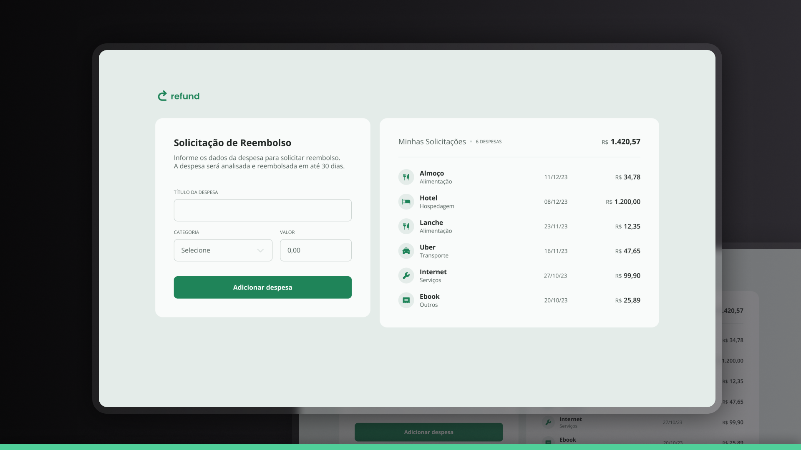

# 💸 Expense Refund Request App

A modern and responsive web application for managing expense refund requests, built with vanilla HTML, CSS, and JavaScript. This project demonstrates fundamental web development concepts and good practices.

## 📸 Preview



## 🚀 Features

- **Add Expenses**: Submit expense refund requests with details like name, category, and amount
- **Expense Categories**: Choose from predefined categories (Food, Accommodation, Services, Transport, Others)
- **Real-time Calculations**: Automatic calculation of total expenses and expense count
- **Currency Formatting**: Brazilian Real (BRL) currency formatting with proper locale
- **Remove Expenses**: Delete individual expense entries
- **Responsive Design**: Fully responsive layout that works on desktop, tablet, and mobile devices
- **Clean UI**: Modern, clean interface with smooth transitions and hover effects

## 🌐 Demo

Access the online version: [Expense Refund App](https://maurodiogodev.github.io/refund-app/)


## 🛠️ Technologies Used

- **HTML5**: Semantic markup and form elements
- **CSS3**: Modern styling with Flexbox, Grid, and responsive design
- **JavaScript (ES6+)**: DOM manipulation, event handling, and data processing
- **Google Fonts**: Open Sans font family for typography

## 🎯 Key Concepts Demonstrated

### HTML
- Semantic HTML structure
- Form validation with `required` attributes
- Accessibility features (alt texts, proper labeling)
- Fieldset and legend elements for form organization

### CSS
- **Responsive Design**: Mobile-first approach with media queries
- **Flexbox Layout**: Modern layout techniques for component alignment
- **CSS Custom Properties**: Root variables for consistent theming
- **CSS Transitions**: Smooth hover effects and interactions
- **Custom Scrollbar**: Styled scrollbar for better UX
- **Form Styling**: Custom select dropdowns and input fields

### JavaScript
- **DOM Manipulation**: Dynamic content creation and updates
- **Event Handling**: Form submission, click events, and input formatting
- **Data Processing**: Currency formatting and calculations
- **Error Handling**: Try-catch blocks for robust error management
- **ES6+ Features**: Arrow functions, template literals, and modern syntax

## 📂 Project Structure

```
expense-refund-app/
├── index.html          # Main HTML structure
├── styles.css          # All CSS styles and responsive design
├── script.js           # JavaScript functionality
└── img/                # Icons and images
    ├── logo.svg
    ├── food.svg
    ├── accommodation.svg
    ├── services.svg
    ├── transport.svg
    ├── others.svg
    ├── remove.svg
    └── chevron-down.svg
```

## 💡 Learning Highlights

This project showcases several important web development skills:

- **Form Handling**: Complete form processing with validation and user feedback
- **Currency Formatting**: Proper Brazilian Real formatting with locale-specific methods
- **Dynamic UI Updates**: Real-time updates to totals and expense counts
- **Responsive Web Design**: Mobile-first approach ensuring great UX across devices
- **Clean Code Practices**: Well-organized, commented, and maintainable code
- **User Experience**: Intuitive interface with proper feedback and error handling

## 🎨 Design Features

- **Modern Color Palette**: Soft greens and neutral tones for a professional look
- **Typography**: Clean, readable fonts with proper hierarchy
- **Interactive Elements**: Hover effects and focus states for better usability
- **Micro-interactions**: Smooth transitions and visual feedback
- **Accessibility**: Proper contrast ratios and semantic markup

Design UI/UX by [Rocketseat](https://www.rocketseat.com.br/)

---


<div align="center"> <p>Developed with ❤️ as part of my web development learning journey.</p> <p>Feel free to contribute or get in touch!</p> </div>
